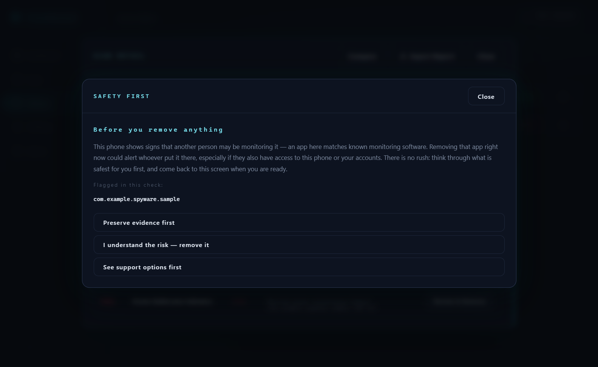
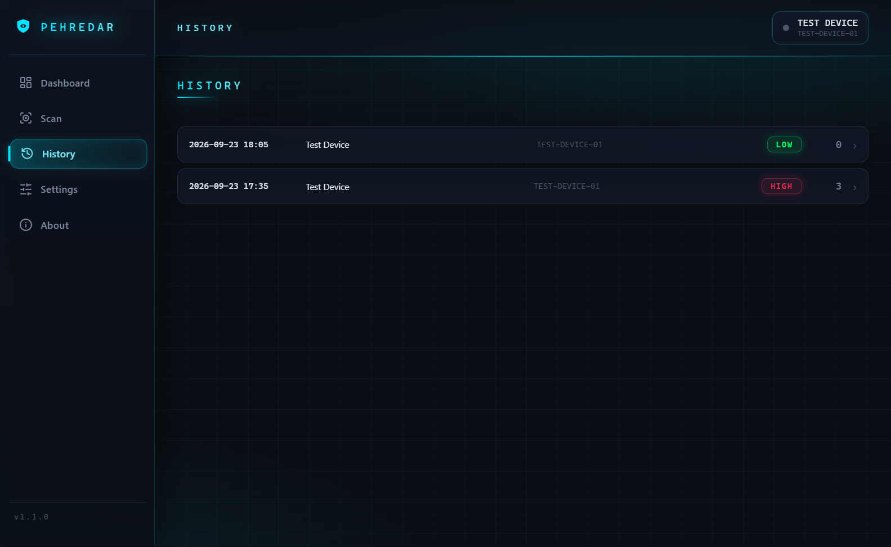

# Pehredar

**Know what's really on your Android phone.**

Pehredar checks your phone for hidden monitoring and tampering — rooting, spyware, stalkerware — over USB, with nothing installed on the phone itself. If something serious turns up, it explains the finding in plain language and never rushes you toward removal: deleting spyware can alert whoever put it there.

## Screenshots

| Dashboard | Live scan |
| --------- | --------- |
|  |  |

| Safety-first flow | History + compare |
| ----------------- | ----------------- |
|  |  |

## Download & install

Grab the latest installer from [GitHub Releases](https://github.com/MadB0i/Pehredar/releases) — Python and ADB are bundled inside, nothing else to install.

- Windows: `Pehredar-*-win-*.exe` (unsigned, so SmartScreen will ask — verify `SHA256SUMS-win.txt`)
- Linux: `Pehredar-*.AppImage` (`chmod +x`, then run)

## Quick start

1. Install Pehredar from the link above.
2. On the phone: tap **Build number** 7 times, turn on **USB debugging**, plug in with USB.
3. Accept the *Allow USB debugging?* prompt on the phone.
4. Click **New Scan** and read the plain-language summary.

## What it checks

| Root / jailbreak (7) | Spyware / stalkerware (5) |
| -------------------- | ------------------------- |
| SU binary, root packages (Magisk/SuperSU), build tags, debuggable props, writable `/system`, BusyBox, Magisk Hide | Hidden apps (no icon), accessibility abuse, device admin/owner, SMS+camera+mic+location combo, known-stalkerware list |

## Safety first

High-risk findings don't lead straight to an Uninstall button. Pehredar shows a calm choice screen first: preserve evidence (stored off the phone, never in a shared account), remove with understanding, or see India support options (112, 181, NCW 14490, Cyber 1930). Scan verdicts are indicators, never proof — verify before acting.

## License & contributing

MIT — see [LICENSE](LICENSE). Bundled ADB licensing: [NOTICE-THIRD-PARTY.md](NOTICE-THIRD-PARTY.md). Contributions welcome — see [CONTRIBUTING.md](CONTRIBUTING.md) (developer guides live in [docs/](docs/for-developers.md)).
