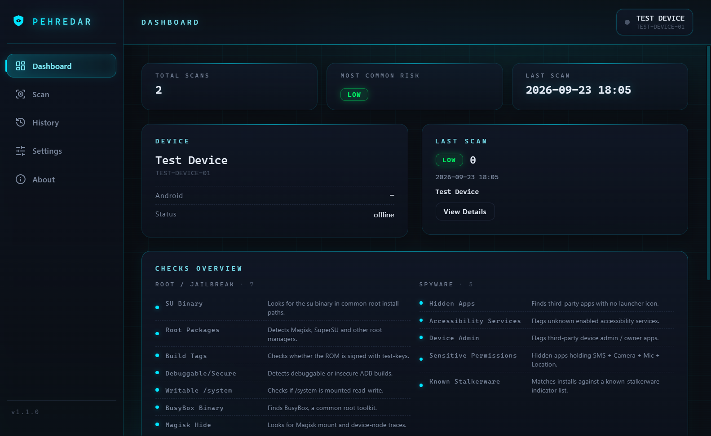
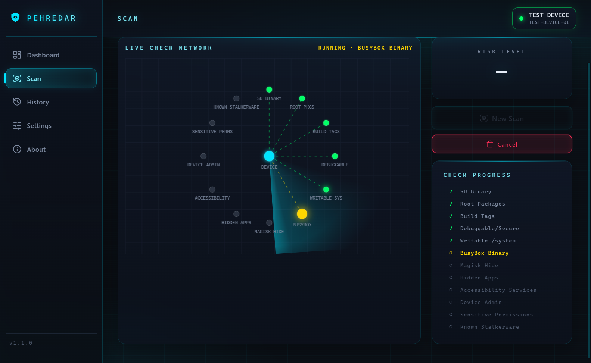

# Pehredar

**Pehredar** (Hindi: पहरेदार, "watchman / guard") checks Android devices for root, jailbreak, and hidden-monitoring indicators over ADB — no on-device installation required.

 <!-- TODO: point at your CI workflow status badge -->


## What is Pehredar?

One tool, two audiences. For developers and QA teams it's a compliance-testing tool that verifies how an Android app behaves against rooted or compromised devices — 11 detection checks over ADB, nothing installed on the phone, and client-ready JSON/HTML reports. For individuals it's a way to check whether your own phone has been tampered with or carries hidden monitoring (spyware/stalkerware) apps — plug in, click a button, read results in plain language. Both share the exact same detection engine; only the presentation differs.

## Screenshots

| Dashboard | Live scan | Scan detail |
| --------- | --------- | ----------- |
|  |  |  |

## Quick Start

```bash
# prerequisites: Python 3.8+ and adb (Android Platform Tools)
git clone https://github.com/MadB0i/Pehredar.git
cd Pehredar
pip install -e .
```

Enable **USB Debugging** on your phone (Settings → Developer Options), connect it, and authorize the computer when prompted. Then:

```bash
pehredar        # runs 11 checks and prints a risk summary
```

Or launch the desktop app: `cd gui && npm install && npm start`.

## Features

- Root/jailbreak detection: su binary, root apps (Magisk/SuperSU), build tags, debuggable props, writable `/system`, BusyBox, Magisk Hide
- Spyware detection: hidden apps, accessibility services, device admin/owner, apps holding SMS + camera + mic + location
- Risk scoring (Low/Medium/High) with JSON report and JSON streaming export
- Electron GUI: animated scan graph, dashboard, history, settings, one-click HTML report export
- Review & Remove: uninstall flagged apps over ADB (system apps protected, explicit confirmation required)
- Simple Mode: plain-language results for non-technical users

## Guides

- **Full developer guide** — extend checks, JSON format, checks reference → [docs/for-developers.md](docs/for-developers.md)
- **Using Pehredar for personal safety** — plain-language explainer → [docs/for-personal-use.md](docs/for-personal-use.md)
- **Contributing** — setup, tests, PR expectations → [CONTRIBUTING.md](CONTRIBUTING.md)

## License

MIT — see [LICENSE](LICENSE).